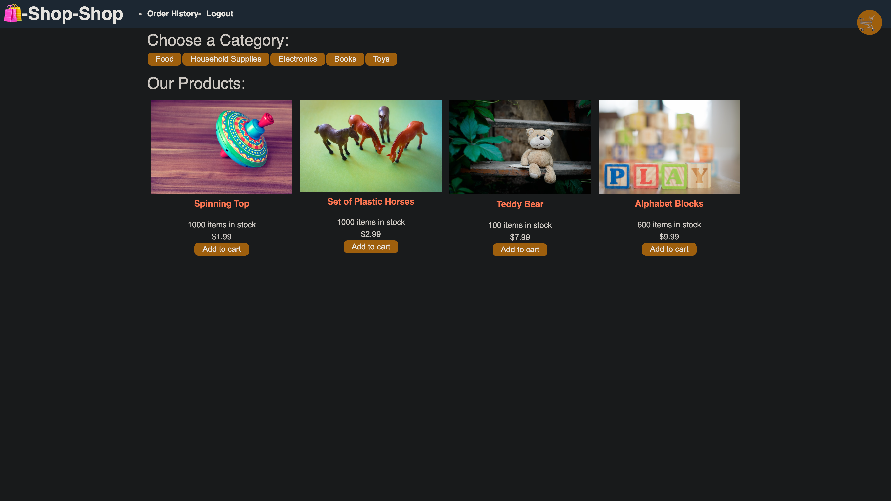
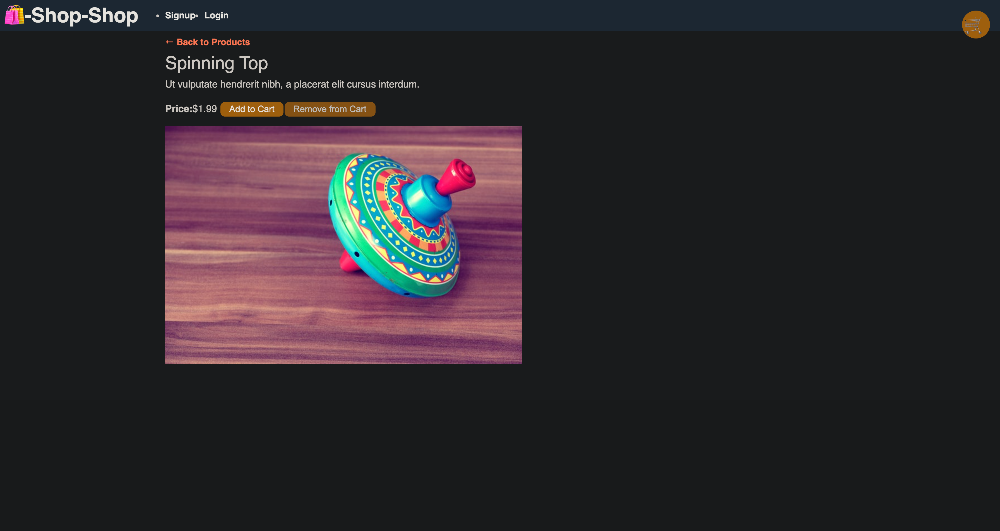
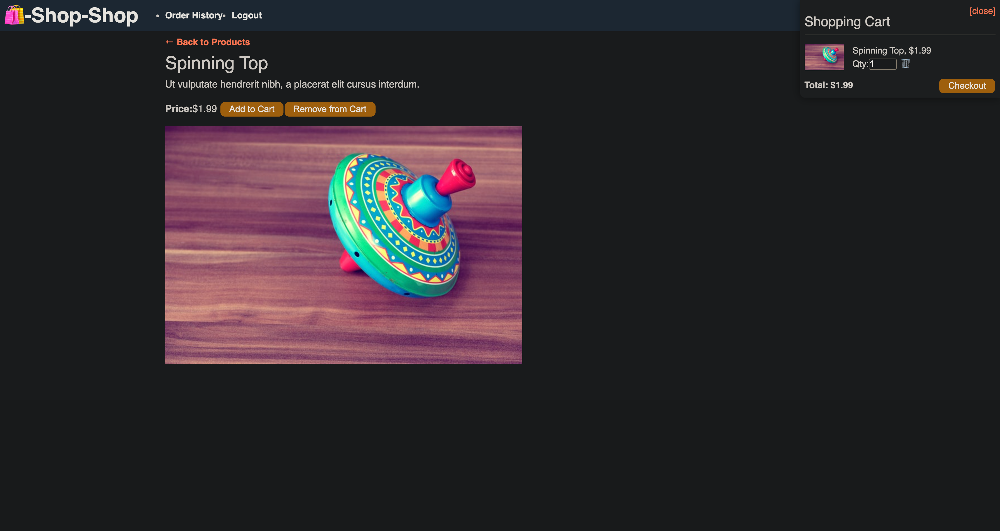
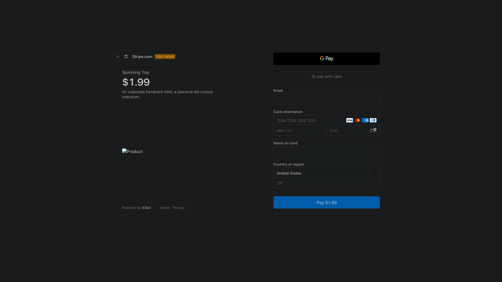
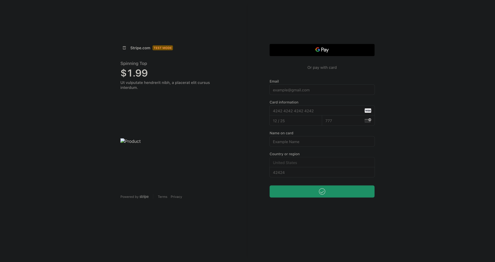
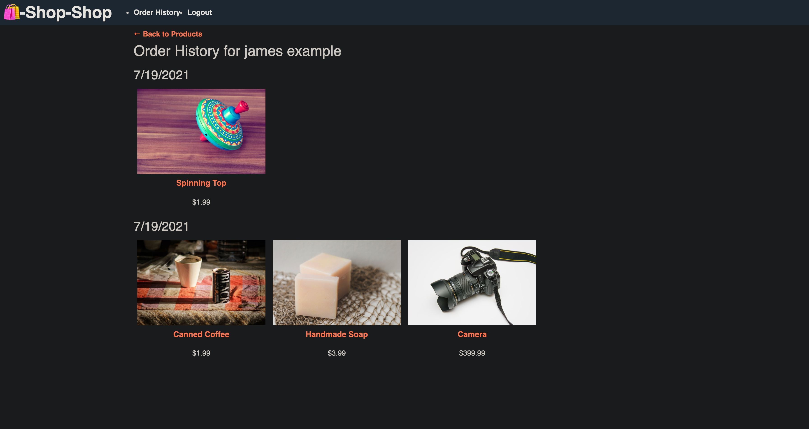

<h1 id="title">🎉 Shop Shop 🎉</h1>

The Shop Shop is a functioning ecommerce application that uses Redux to keep track of state globally.

<h2>Table of Contents 📚<h2>

* [Shop Shop Products](#products)
* [Cart](#cart)
* [Purchasing](#purchase)
* [Built With](#built)
* [Opinions](#code)
* [GraphQL](#graph)
* [Apollo](#apollo)
* [MongoDB](#mongo)
* [React](#react)
* [Redux](#redux)
* [Future Updates](#future)
* [Author](#author)
* [Contributions](#contribute)
* [Give Support](#Support)

<h2 id="products">Products in Shop Shop 🏪</h2>

Shop Shop is a ecommerce application that allows users to sign up and login to purchase a variety of goods online. After sign-up users can search through the items with categories. Within each category is a list of products relating to that category. Each product has an image, name, number in stock, price, and an "Add to Cart" button. Below there is an example image of searching by the "Toys" category. After clicking on the "Toys" category button, we see the corresponding products and their information.

&nbsp

&nbsp

Clicking on an individual image links to that product's details page. We see that the description of the product has also been added. We also have the ability to add and remove the item from the cart.

&nbsp

&nbsp

<h2 id="cart">Cart Items 🛒</h2>

Once logged in, a user may add products to their shopping cart. Let's add the Spinning Top we were looking at earlier. We see that the cart icon in the top right corner opens up and shows us the cart and any items that are within.

&nbsp

&nbsp

We can remove any cart items by two methods: one method is to click the button that is labeled "Remove from Cart", while the other method is to click a trash icon next to the item inside of our cart. Either way the functionality is the same, and the item is removed from the cart. We can also increase/decrease the quantity of each product by clicking the up and down arrows next to the quantity number in our cart as well.

<h2 id="purchase">Purchasing Products 💰</h2>

When you are ready to purchase your products, we can use Stripe. The Stripe electronic payment processing service has a development feature to test actual functionality. If we click on the checkout button, we are taken to a Stripe test-mode where we can google pay or pay with a card.

&nbsp

&nbsp

Once we enter some fake data for our purchase, we can see what the real checkout experience will be! Let's enter the "4242 4242 4242 4242" for our credit card number as Stripe suggests, along with any future date, and any three numbers for the CVV. For our example I will use "12/25" and "777".

&nbsp

&nbsp

After a green success bar and a brief success message on the screen you are taken back to the homepage. You can inspect your previous orders at any time from the navigation bar, as long as you are logged in.

&nbsp

&nbsp

After looking at your orders you could go "Back to Products" through the link at the top of the page and do some more shopping, or feel free to logout. This ends the application tour, if you would like to know more about the coding process for this application however, please continue on.

&nbsp

<h2 id="built">Built With 🛠️</h2>

Most applications use HTML, CSS, and JavaScript. This application is no different. However, there are some technologies that make it stand out. Below you will find a list of the more interesting technologies. They are linked to descriptive websites as well. Please enjoy.

<ul>
<li><strong><a href="https://graphql.org/">GraphQL</a></strong></li>
<li><strong><a href="https://www.apollographql.com/">Apollo</a></strong></li>
<li><strong><a href="https://www.mongodb.com/">MongoDB</a></strong></li>
<li><strong><a href="https://reactjs.org/">React</a></strong></li>
<li><strong><a href="https://redux.js.org/">Redux</a></strong></li>
</ul>

&nbsp

<h2 id="thoughts">Opinions 🧐</h2>

Below are some of my current thoughts on some of the technologies used in this application.

&nbsp

<h2 id="graph">GraphQL 📈</h2>

&nbsp

I began with Apollo and GraphQL. GraphQL is not language specific and you won't be limited by a certain choice for your database technology either. It makes the CRUD methodology for both SQL and NoSQL databases a breeze. They make API code extremely clean and easy to update without affecting existing queries. They do this through single evolving versions. They have an amazing development tool GraphiQL which makes working in your local host website browser incredibly simple. You can do this from your server-side server instance or your devTools if you get the extension.

&nbsp

<h2 id="apollo">Apollo 🌅</h2>

 You can't talk about GraphQL without Apollo. True, it isn't necessary to use GraphQL, but it was made to pair with it perfectly (in my opinion). Later we will talk about Redux but there is a commonality I have found between Apollo and Redux... a single source of truth. Applications tend to get confusing as they grow and become more complex. Within that complexity it is easy to get confused about where data is coming from, how it is being recieved, and where it is going. Apollo uses a schema based on the Model definitions of the database. That file is usually called typeDefs, because it holds the "type" definitions. This is where Apollo really shines. In our type definitions we define all the ways we will interact with data, and how we want that data returned, AND which PARTS of the data! That's right no more API calls that give you everything, and through functions you access the data you want. Now you are returned the data as you have requested it. Of course it is a bit more complicated than that, there are queries (GET request), and mutations(POST, CREATE, DELETE), and also resolver functions, which tell how you <em>resolve</em> the data once you have it. Needless to say, it is well worth your time and effort to learn some of the basic interactions between Apollo and GraphQL. They are a powerful duo.

&nbsp

<h2 id="mongo">MongoDB 📑</h2>

MongoDB is a NoSQL database that was used in this application. I have been a part of many discussions on which database structure is better, NoSQL or SQL. I hate to say this dreaded, non-commital phrase, but..."It depends?". As much as I don't like it, it's true. It depends on what you are building and how. How large is the data storage going to be? Will there be frequent updates and changes to the database? These are important factors to consider when working with databases. I will say that the nice part about Mongo is that it already uses JSON format, so it makes working with Mongo in JavaScript pretty simple. For scalibilty and a lot of changes, Mongo can keep pace and not make things too difficult on developers. However, SQL database management systems like MySQL and SQLite have their perks as well. The rigidity of the structure may seem like a problem at first, and the syntax can be a bit much to keep track of, but that structure provides consistency with your data. That syntax gives very specific guidelines on what you can and cannot do with your data. You will eliminate a lot of redundancy and have a well organized data source, because you have to. They take a bit more planning on the front end, but I don't think that is necessarily a bad thing, it just... depends. 😉

&nbsp

<h2 id="react">React 🏃‍♂️</h2>

Someone once told me what the difference between a framework and a library(in their opinion) was. A framework they said was a rigid layout to guide beginners and those who don't understand the nuances of a coding language, while a library was a set of tools for a more experienced developer to create and build with the full expression of a language. While this may not be the most technical definition, I really enjoy it. React is a library, and with this library you have access to so many tools with which to build the most modern single page applications, as well as progressive web applications. Using components and JSX instead of innumerable html and script files everywhere. You can modularize your code in ways that was never possible before. This application was first built using amazing new features in React called "context" and "hooks". Using these tools you no longer have to pass props down through nested components, but instead set a global state when you need to, and give ALL components access to that data and it's current state. This wasn't always possible though, and surely not as simple. In order to use global state in the past we needed another library called Redux.

&nbsp

<h2 id="redux">Redux 💻</h2>

Although Redux has become synonymous with React, it is technologically agnostic. You can use it with many differnt types of technologies. However it did gain a lot of popularity with React for predictable, easy to test global state. Their other libraries include React-Redux which is a tailor made library for React, and Redux-Toolkit. Redux may have had popularity as a React library add-on, but predictable and easy to test, does not mean easy to understand and use. There was confusion about containers around components, mapping, and also around the necessary "connect" syntax. Not that these were insurmountable, but they were not as efficient as they could be, nor as intuitive. This has changed in recent years. As React has grown with their own global state methods of "context" and "hooks", Redux answered with an upgraded version of their own, the aforementioned Redux-Toolkit. This is a recent technology, and I am still learning it's many uses. The createSlice for reducers and configureStore instead of createStore seem very interesting though. I even for a time blended React hooks with Redux and Redux-Toolkit, just for laughs. It works because these technologies follow three principles when it comes to global state. The first is a single source of truth for data. When you are setting state, it must come from a single source. The second is that data must be immutable. You cannot change it, you must make a copy and alter the copy which will then become the new instance of state. Only have one store per application. You can keep track of as many different states as you want, but only have one store which provides the current state to your application.

&nbsp

<h2 id="future">Future Updates ⏳</h2>

<ul>
<li>[X] Use React context and hooks</li>
<li>[X] Refactor with Redux</li>
<li>[ ] Refactor again with Redux-Toolkit.</li>
<li>[ ] Administration account to add products.</li>
<li>[ ] Use a different payment service like Shopify.</li>
<li>[ ] What would you like to add to the application?</li>
</ul>

&nbsp

<h2 id="author">Author 👋</h2>

**John Patrick Banas**

- [GitHub Profile 🖥️](https://github.com/JohnBanas)
- [Email 📧](mailto:jbanas9124@gmail.com)
- [Portfolio 💼](https://johnbanas.github.io/portfolio/)

&nbsp

<h2 id="contribute">Contributions 💚</h2>

None of this would be possible without the love and support of my wife Sam and our dog Teddy. Thank you to my nephew Mitchell for letting me help him with his homework, and through that, discover my love of computer science. The wonderful folks at the Vanderbilt Owen School of Engineering Bootcamp. All the Instructors, TA's, Graders, Tutors, and Admin team who made my journey possible. Also to all the coders out there who teach me something new everyday, through Slack, StackOverflow, GitHub, Dev, Codecademy, Coursera, CodeNewbie, Udemy, Dataquest, and too many others to name here. I am grateful for the knowledge freely given, and I will freely give knowledge in return. Thank you most of all, to <strong><em>YOU</em></strong> for reading this far! <strong>👏 🤣</strong>

&nbsp

<h2 id="support">Give Support 👏</h2>

If you would like to contribute, have any commentary, corrections, or suggestions, please feel free to contact me through my email provided in the Author section. If you like the project, I would appreciate giving a ⭐ in support.

[Back To Top of Page](#title)

